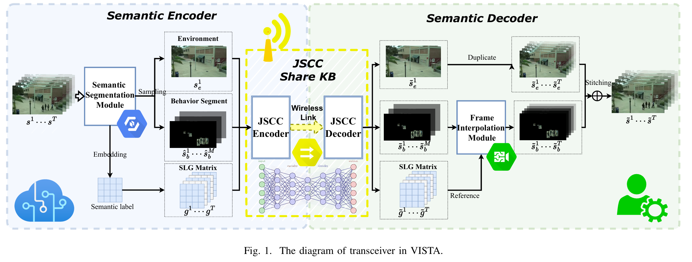
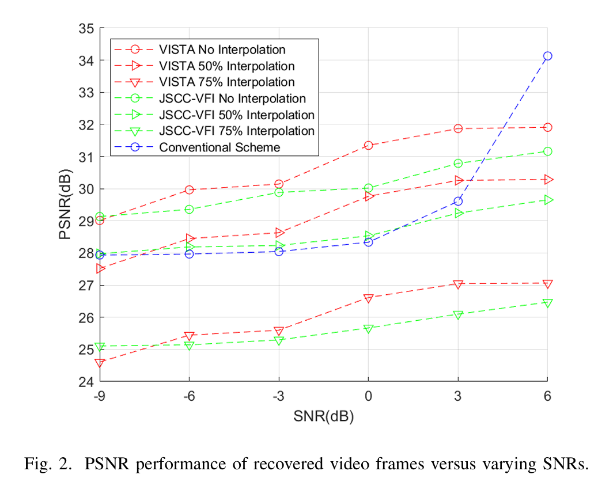
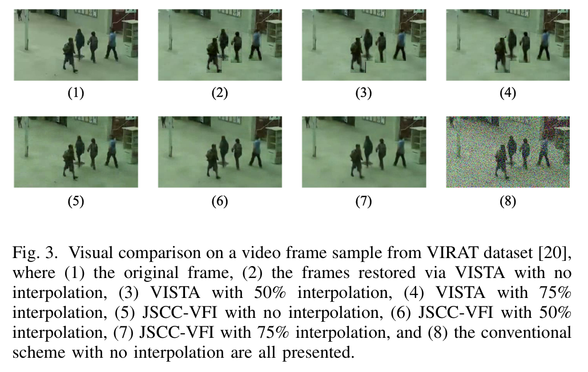
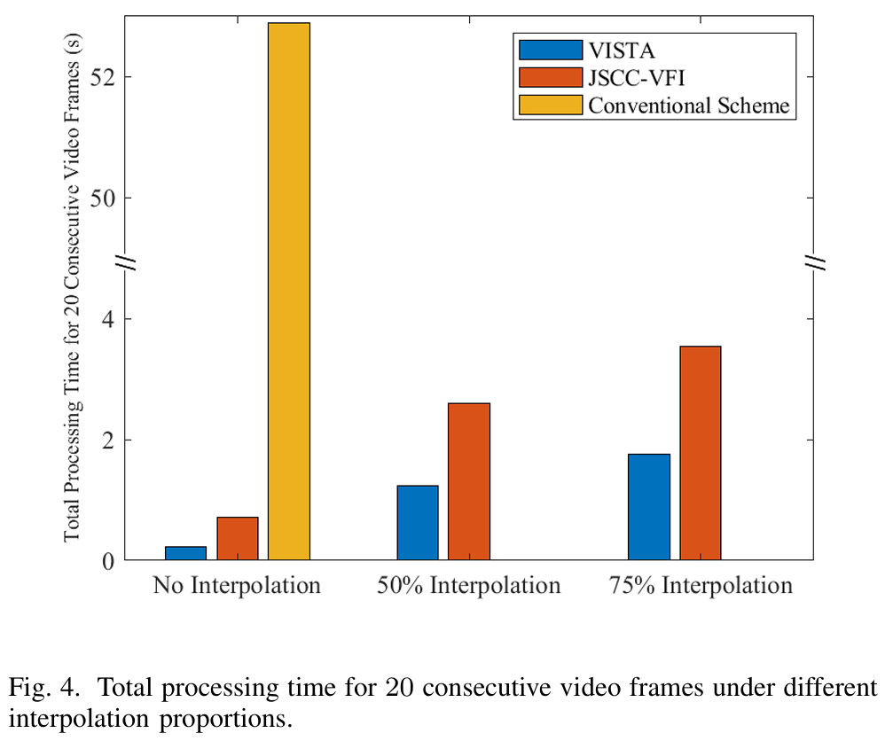
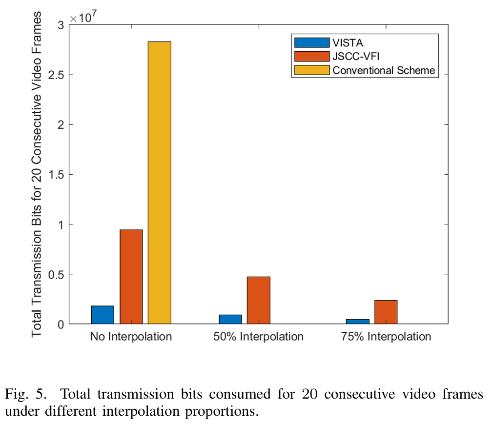

VISTA

VISTA (Video Transmission over A Semantic Communication Approach) is a semantic video transmission framework for wireless environments.
Instead of transmitting full pixel-level video frames, VISTA transmits semantic information to reduce bandwidth consumption while maintaining reconstruction quality.

This repository contains the implementation of the VISTA pipeline and the main components used in the project.

Overview

Traditional wireless video transmission usually sends pixel-level information directly, which can require high bandwidth and processing cost.
VISTA addresses this problem by separating video content into semantic parts and transmitting only the most necessary information.

Specifically, VISTA divides the video into:

Environment segment: static background information

Behavior segment: moving objects

SLG (Semantic Location Graph): semantic labels and object location information across frames

These semantic components are then transmitted through a channel-adaptive JSCC module, and the receiver reconstructs the video using frame interpolation and semantic guidance.

  
 
<em>Figure 1. The diagram of transceiver in VISTA.</em>

Pipeline
1. Semantic Segmentation

In the first step of the process, frames to be transmitted are first segmented into static objects and moving objects.
MMSegmentation is used here for this purpose.

Run:

..\VISTA\mmsegmentation-master\demo\img_seg.py

This stage provides the semantic information needed for the following transmission and reconstruction process.

2. Dynamic JSCC

The semantic features are transmitted through a dynamic joint source-channel coding (JSCC) module, which adapts to channel conditions.

This part is based on the paper:

Deep Joint Source-Channel Coding for Wireless Image Transmission with Adaptive Rate Control

Source GitHub page:
https://github.com/mingyuyng/Dynamic_JSCC

3. Video Frame Interpolation

At the receiver side, lost frames are interpolated based on received ones to recover the full video.

This part is based on the paper:

Video Frame Interpolation with Transformer

Source GitHub page:
https://github.com/dvlab-research/VFIformer

Run:

..\VISTA\VFIformer-main\video_interpolation_paper.py
Main Idea

The core idea of VISTA is to avoid transmitting redundant visual information.

The static environment can be transmitted more efficiently

The dynamic behavior segments are sampled and reconstructed

The semantic location graph helps preserve object semantics and spatial structure

The frame interpolation module restores missing frames to recover a complete video sequence

By combining semantic segmentation, adaptive JSCC, and frame interpolation, VISTA improves transmission efficiency while preserving visual quality.

Results
PSNR Performance

The figure below shows the PSNR performance of recovered video frames under different channel SNRs.

  
 
<em>Figure 2. PSNR performance of recovered video frames versus varying SNRs.</em>

This result shows how reconstruction quality changes under different channel conditions and interpolation ratios.

Visual Comparison

The figure below compares reconstruction quality on a sample frame from the VIRAT dataset, including:

the original frame

VISTA with different interpolation ratios

JSCC-VFI with different interpolation ratios

the conventional scheme

  
 
<em>Figure 3. Visual comparison on a video frame sample from the VIRAT dataset.</em>

This comparison shows that VISTA can preserve the main visual structure of the scene while maintaining better perceptual quality than the conventional baseline under challenging transmission settings.

Processing Time

The figure below shows the total processing time for 20 consecutive video frames under different interpolation proportions.

  
 
<em>Figure 4. Total processing time for 20 consecutive video frames under different interpolation proportions.</em>

This result highlights the efficiency of VISTA in terms of end-to-end processing cost.

Transmission Bits

The figure below shows the total transmission bits consumed for 20 consecutive video frames under different interpolation proportions.

  
 
<em>Figure 5. Total transmission bits consumed for 20 consecutive video frames under different interpolation proportions.</em>

This demonstrates the main advantage of VISTA: reducing transmission overhead by sending semantic information instead of full raw video content.

Project Structure

A possible structure of this project is:

VISTA/
├── mmsegmentation-master/
│   └── demo/
│       └── img_seg.py
├── VFIformer-main/
│   └── video_interpolation_paper.py
├── results/
│   ├── Fig1.png
│   ├── Fig2.png
│   ├── Fig3.png
│   ├── Fig4.png
│   └── Fig5.png
└── README.md
Notes

Sample videos and simulation results can be found in the video file(s).

All figures used in this README are stored under the results/ folder.

Acknowledgements

This project uses or builds upon the following open-source repositories:

MMSegmentation

Dynamic JSCC: https://github.com/mingyuyng/Dynamic_JSCC

VFIformer: https://github.com/dvlab-research/VFIformer
